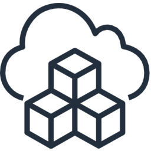

<a name="readme-top"></a>

<!-- PROJECT LOGO -->
<br />
<div align="center">
<table style="border-collapse: collapse;">
  <tr>
    <td>
      <a href="https://github.com/clemans/net.clemans.Storage/">
        
      </a>
    </td>
  </tr>
</table>
  <h3 align="center">AWS Simple Storage Services (S3)</h3>
  <p align="center">
    AWS Simple Storage Services (S3) resources for the self-hosted domain: clemans.net.
    <br />
    <a href="https://github.com/clemans/net.clemans.Storage/">
      <strong>Explore the docs</strong>
    </a>
    <br />
    <br />
    <a href="https://github.com/clemans/net.clemans.Storage/">
      View Demo
    </a>
    •
    <a href="https://github.com/clemans/net.clemans.Storage/issues">
      Report Bug
    </a>
    •
    <a href="https://github.com/clemans/net.clemans.Storage/issues">
      Request Feature
    </a>
  </p>
</div>

<!-- TABLE OF CONTENTS -->
<details>
  <summary>Table of Contents</summary>
  <ol>
    <li>
      <a href="#about-the-project">About The Project</a>
      <ul>
        <li><a href="#built-with">Built With</a></li>
      </ul>
    </li>
    <li>
      <a href="#getting-started">Getting Started</a>
      <ul>
        <li><a href="#prerequisites">Prerequisites</a></li>
        <li><a href="#deployment">Deployment</a></li>
      </ul>
    </li>
    <li><a href="#roadmap">Roadmap</a></li>
    <li><a href="#contributing">Contributing</a></li>
    <li><a href="#license">License</a></li>
    <li><a href="#contact">Contact</a></li>
    <li><a href="#acknowledgments">Acknowledgments</a></li>
  </ol>
</details>

## About The Project

The infrastructure within this project is built exclusively on the
*AWS Cloud Development Kit ([AWS CDK][AWSCDK-url])*.

### Built With

Below are the major frameworks/libraries used to bootstrap this project.

- [![AwsCdk][AwsCdk]][AwsCdk-url]
- [![Typescript][Typescript]][Typescript-url]
- [![Node][Node.js]][Node-url]
- [![Jest][Jest]][Jest-url]
- [![ESLint][ESLint]][ESLint-url]

<p align="right">(<a href="#readme-top">back to top</a>)</p>

## Getting Started

For a manual deployment, follow the below instructions and prerequisites.

### Prerequisites

*Install the latest version of Node.js and NPM using the Node version manager
['NVM'](https://nvm.sh/).

- NPM

  ```bash
  curl -fsSL https://raw.githubusercontent.com/nvm-sh/nvm/v0.38.0/install.sh |
  bash && source ~/.nvm/nvm.sh &&
  nvm install node
  ```

- AWS-CDK

  ```bash
  npm install --global aws-cdk
  cdk bootstrap --profile <profile_name>
  ```

### Deployment

*The below steps will guide you on successfully deploying your
AWS CloudFormation stack(s).*

1. Confirm your AWS Credentials are configured. More info at:
[Configure the AWS CLI](https://docs.aws.amazon.com/cli/latest/userguide/cli-chap-configure.html)

2. Clone the repo

   ```bash
   git clone https://github.com/clemans/net.clemans.Storage.git
   ```

3. Configure `.env` & `config/parameters.ts` files relative to your own setup.

4. Install NPM packages

   ```bash
   npm install
   ```

5. Deploy the AWS CDK CloudFormation stack(s)

   ```bash
   npm run start
   ```

6. Destroy the AWS CDK CloudFormation stack(s)

    ```bash
    npm run destroy
    ```

<p align="right">(<a href="#readme-top">back to top</a>)</p>

## Roadmap

  | TO DO           | Description                                    | Status
  | --              | --                                             | --
  | Unit Coverage   | Adds Jest Unit Test support                    | 📝 WIP
  | GitHub Actions  | Continuous integration and project automation  | 📚 Backlog

See the [open issues][GitHubIssue-url]
for a full list of proposed features and known issues.

<p align="right">(<a href="#readme-top">back to top</a>)</p>

## Contributing

Contributions are what make the open source community
such an amazing place to learn, inspire, and create. Any contributions you make are
**greatly appreciated**.

If you have a suggestion that would make this better, please fork the repo & create a pull request.
You can also simply open an issue with the tag "enhancement".
Don't forget to give the project a star! Thanks again!

1. Create your Feature Branch (`git checkout -b feature/jira-issue`)
2. Commit your Changes (`git commit -m 'Add some AmazingFeature'`)
3. Push to the Branch (`git push origin feature/jira-issue`)
4. Open a Pull Request

<p align="right">(<a href="#readme-top">back to top</a>)</p>

## License

Distributed under the MIT License. See `LICENSE.txt` for more information.

<p align="right">(<a href="#readme-top">back to top</a>)</p>

## Contact
Open a [GitHub Issue][GitHubIssue-url].

## Acknowledgments

Thanks to all the projects and services to making this possible:

- [Choose an Open Source License](https://choosealicense.com)
- [Img Shields](https://shields.io)

<p align="right">(<a href="#readme-top">back to top</a>)</p>

<!-- https://www.markdownguide.org/basic-syntax/#reference-style-links -->
[AwsCdk]: https://img.shields.io/badge/AWS%20CDK-v2.130.0-green?style=appveyor&logo=amazonaws
[AwsCdk-url]: https://aws.amazon.com/cdk/
[ESLint]: https://img.shields.io/badge/ESLint-^8.57.0-green?style=appveyor&logo=eslint
[ESLint-url]: https://eslint.org
[GitHubIssue-url]: https://github.com/clemans/net.clemans.Storage/issues
[Jest]: https://img.shields.io/badge/Jest-^29.7.0-green?style=appveyor&logo=jest
[Jest-url]: https://jestjs.io/
[Node.js]: https://img.shields.io/badge/Node.js-21.6.1-green?style=appveyor&logo=nodedotjs
[Node-url]: https://nodejs.org/
[Typescript]: https://img.shields.io/badge/Typescript-~5.3.3-green?style=appveyor&logo=typescript
[Typescript-url]: https://www.typescriptlang.org/